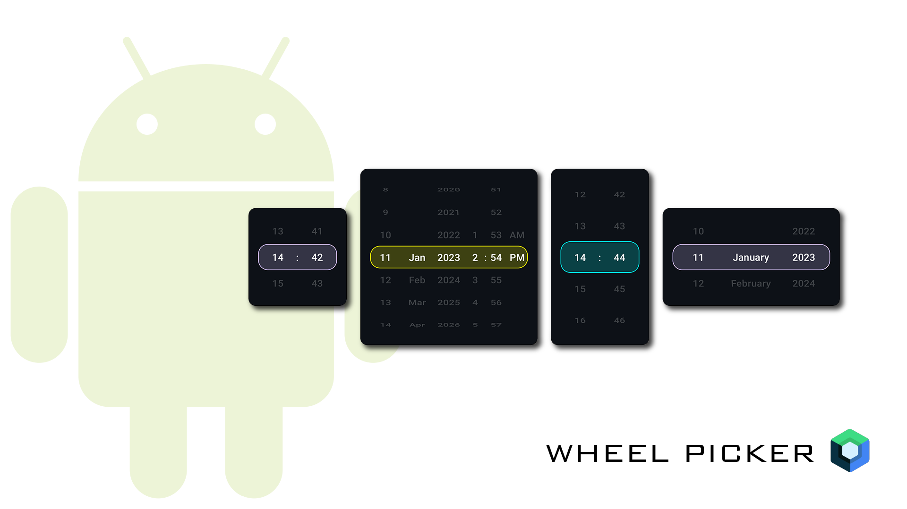

# WheelPickerCompose [](https://jitpack.io/#commandiron/WheelPickerCompose) <a href="https://android-arsenal.com/api?level=21"></a>

Add Wheel Date - Time Picker in Android Jetpack Compose.

 

## Usage
|Picker|Usage|
|------|-----|
||```WheelDateTimePicker { snappedDateTime -> }```|
||```WheelDatePicker { snappedDate -> }```|
||```WheelTimePicker { snappedTime -> }```|
||```WheelTimePicker(timeFormat = TimeFormat.AM_PM) { snappedTime -> }```|

## Features

<table>
<tr>
<td>
            
```kotlin  
WheelDateTimePicker(
    startDateTime = LocalDateTime.of(
        2025, 10, 20, 5, 30
    ),
    minDateTime = LocalDateTime.now(),
    maxDateTime = LocalDateTime.of(
        2025, 10, 20, 5, 30
    ),
    timeFormat = TimeFormat.AM_PM,
    size = DpSize(200.dp, 100.dp),
    rowCount = 5,
    textStyle = MaterialTheme.typography.titleSmall,
    textColor = Color(0xFFffc300),
    selectorProperties = WheelPickerDefaults.selectorProperties(
        enabled = true,
        shape = RoundedCornerShape(0.dp),
        color = Color(0xFFf1faee).copy(alpha = 0.2f),
        border = BorderStroke(2.dp, Color(0xFFf1faee))
    )
){ snappedDateTime -> }
```
</td>
<td>  
    

    
</td>
</tr>
</table>
<table>
<tr>
<td>
            
```kotlin  
GroupedWheelDateTimePicker(
    startDateTime = LocalDateTime.of(
        2023, 6, 22, 5, 30
    ),
    minDateTime = LocalDateTime.of(
        2023, 4, 20, 5, 30
    ),
    maxDateTime = LocalDateTime.of(
        2023, 10, 20, 5, 30
    ),
    todayLabel = "Today",
    dateFormat = DateTimeFormatter.ofPattern("EEE d MMM yy"),
    timeFormat = TimeFormat.HOUR_24,
    size = DpSize(300.dp, 200.dp),
    rowCount = 5,
    textStyle = MaterialTheme.typography.bodyLarge,
    textColor = Color(0xFFFFFFFF),
    selectorProperties = WheelPickerDefaults.selectorProperties(
        enabled = true,
        shape = RoundedCornerShape(5.dp),
        color = Color(0xFF036AB3).copy(alpha = 0.2f),
        border = BorderStroke(1.dp, Color(0xFF036AB3))
    )
) { println(it) }
```
</td>
<td>  
            


</td>
</tr>
</table>

## Setup
1. Open the file `settings.gradle` (it looks like that)
```groovy
dependencyResolutionManagement {
    repositoriesMode.set(RepositoriesMode.FAIL_ON_PROJECT_REPOS)
    repositories {
        google()
        mavenCentral()
        // add jitpack here 👇🏽
        maven { url 'https://jitpack.io' }
       ...
    }
} 
...
```
2. Sync the project
3. Add dependency
```groovy
dependencies {
    implementation 'com.github.commandiron:WheelPickerCompose:1.1.11'
}
```
4. < API 26 (optional)
```groovy
compileOptions {
    coreLibraryDesugaringEnabled true
    //
}
//
dependencies {
    //
    coreLibraryDesugaring "com.android.tools:desugar_jdk_libs:1.1.6"
}
```
